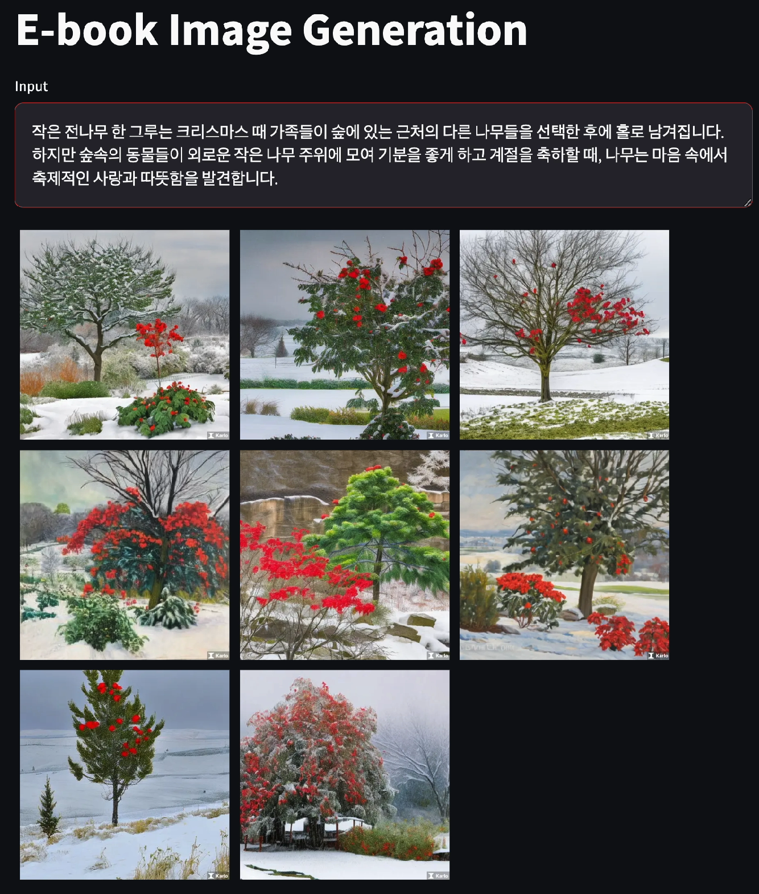

# graduation-project
Summarize specific chapters in an e-book to create appropriate images

```
## Requirements
```
torch==2.0.1
transformers==4.32.1
tokenizers==0.13.3
lightning==2.0.8
streamlit==1.26.0
wandb==0.15.9
```
## Data
- [문화 빅데이터 플랫폼 - 도서별 상세정보](https://www.bigdata-culture.kr/bigdata/user/data_market/detail.do?id=63513d7b-9b87-4ec1-a398-0a18ecc45411) 의 데이터 활용
- 학습 데이터에서 임의로 Train / Test 데이터 생성
- 데이터 탐색에 용이하게 tsv 형태로 데이터 변환
- Data 구조
    - Train Data : 18,640
    - Test Data : 4,661
  
| BOOK_INTRCN_CN  | SUMMARY |
|-------|--------:|
| 서적소개내용(=원문 text) | IMAGE_URL을 FuseCap Model에 통과한 요약 text |  

## Demo
- 이미지 출력을 위해, infer.py line 12 'Karlo API KEY' 입력 필요
- streamlit을 활용하여 Demo 실행
    - 실행 시 <b>http://localhost:8501/</b> 로 Demo page가 실행됨
```
streamlit run infer.py
```

- Demo Page 실행 결과  


## Reference
- [KoBART](https://github.com/SKT-AI/KoBART)
- [KoBART-summarizaiton](https://github.com/seujung/KoBART-summarization.git)
- [FuseCap](https://github.com/RotsteinNoam/FuseCap.git)
